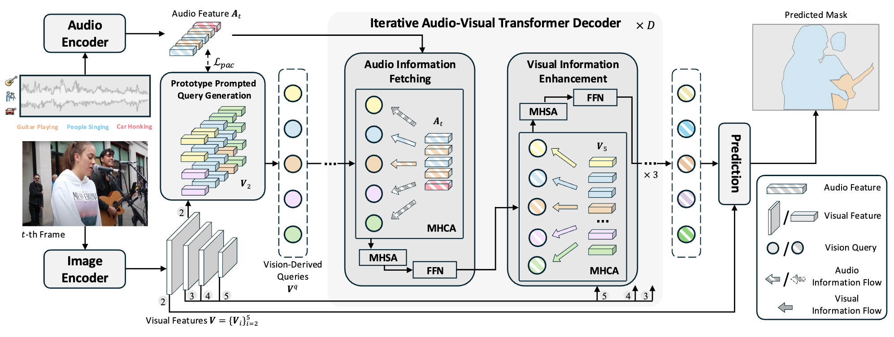

# VCT_AVS
This repo is the official PyTorch implementation for:

[Revisiting Audio-Visual Segmentation with Vision-Centric Transformer](https://openaccess.thecvf.com/content/CVPR2025/papers/Huang_Revisiting_Audio-Visual_Segmentation_with_Vision-Centric_Transformer_CVPR_2025_paper.pdf). Accepted by CVPR 2025.


In this paper, we propose a new Vision-Centric Transformer (VCT) framework that leverages vision-derived queries to iteratively fetch corresponding audio and visual information, enabling queries to better distinguish between different sounding objects from mixed audio and accurately delineate their contours. Additionally, we also introduce a Prototype Prompted Query Generation (PPQG) module within our VCT framework to generate vision-derived queries that are both semantically aware and visually rich through audio prototype prompting and
pixel context grouping, facilitating audio-visual information aggregation.


## Installation

After setting up the environment, clone this repo:

```
conda create -n vct_avs python==3.8 -y
conda activate vct_avs

git clone https://github.com/spyflying/VCT_AVS.git
cd VCT_AVS

conda install pytorch==1.13.1 torchvision==0.14.1 torchaudio==0.13.1 cudatoolkit=11.7 -c pytorch -c nvidia
git clone https://github.com/facebookresearch/detectron2
cd detectron2
pip install -e .

cd ..
pip install -r requirements.txt

cd models/modeling/pixel_decoder/ops
bash make.sh
```

---

#### **Step 1.** Create a conda virtual environment and activate it
```
conda create -n lane3d python=3.7 -y
conda activate lane3d
conda install pytorch==1.9.1 torchvision==0.10.1 cudatoolkit=11.1 -c pytorch -y
```

#### **Step 2.** Install dependencies
```
pip install -U openmim
mim install mmcv-full
pip install -r requirements.txt
```
Refer to [ONCE-3dlane](https://github.com/once-3dlanes/once_3dlanes_benchmark/tree/master/wheels) to install `jarvis`.

#### **Step 3.** Install Anchor3DLane
```
git clone https://github.com/tusen-ai/Anchor3DLane.git
cd Anchor3DLane
python setup.py develop
```
Compile multi-scale deformable attention:
```
cd mmseg/models/utils/ops
sh make.sh
```

This repository is built upon [COMBO-AVS](https://github.com/yannqi/COMBO-AVS) codebase. Please refer to the [original combo-avs repository](https://github.com/yannqi/COMBO-AVS?tab=readme-ov-file#1-environments) for more detailed information of installation.

## Data Preparation
Download [AVSBench](https://github.com/OpenNLPLab/AVSBench) dataset and organize the data folders as follos:

```
|--AVS_dataset
   |--AVSBench_semantic/
   |--AVSBench_object/Multi-sources/
   |--AVSBench_object/Single-source/
```

Process the dataset for 384x384 resolution by running:
```
python avs_tools/preprocess_avss_audio.py
python avs_tools/generate_data_384/ms3_process.py
python avs_tools/generate_data_384/s4_process.py
python avs_tools/generate_data_384/ss_process.py
```

## Download Pretrained Models

Download Swin-Base-384 pretrained on ImageNet-22K from [download](https://github.com/SwinTransformer/storage/releases/download/v1.0.0/swin_base_patch4_window12_384_22k.pth).
Convert the original model with:
```
cd avs_tools
python swin_base_patch4_window12_384_22k.pth swin_base_patch4_window12_384_22k.pkl
```

Please refer to [COMBO-AVS](https://github.com/yannqi/COMBO-AVS/tree/main?tab=readme-ov-file#3-download-pre-trained-models) to download other pretrained models.


## Model Zoo
We provide the SOTA checkpoints for Swin-B-384 setting:

Subset | M_J | M_F | HuggingFace Link
---:|:---:|:---:|:---:
Single-Source | 86.2 | 93.4 | [download](https://huggingface.co/nowherespyfly/VCT_AVS/blob/main/s4_swinb_384/model_best.pth) 
Multi-Source | 67.6 | 81.4 |  [download](https://huggingface.co/nowherespyfly/VCT_AVS/blob/main/ms3_swinb_384/model_best.pth)
Semantic | 52.5 | 56.9 | [download](https://huggingface.co/nowherespyfly/VCT_AVS/blob/main/ss_swinb_384/model_best.pth)

## Testing
Run the following commands to evaluate the given checkpoint:
```
sh scripts/$subset$_swinb_384_test.sh
```

## Training
Run the following commands for training:
```
sh scripts/$subset$_swinb_384_train.sh
```

# Citation
If you find this repo useful for your research, please cite
```
@inproceedings{huang2025revisiting,
  title={Revisiting Audio-Visual Segmentation with Vision-Centric Transformer},
  author={Huang, Shaofei and Ling, Rui and Hui, Tianrui and Li, Hongyu and Zhou, Xu and Zhang, Shifeng and Liu, Si and Hong, Richang and Wang, Meng},
  booktitle={Proceedings of the IEEE/CVF Conference on Computer Vision and Pattern Recognition},
  year={2025}
}
```

# Contact
For questions about our paper or code, please contact **Shaofei Huang**(nowherespyfly@gmail.com).